# Como criar um pendrive bootável com Ubuntu

Se você está querendo começar no mundo do Linux, o Ubuntu é uma das distribuições mais amigáveis para iniciantes. Nesse tutorial, você vai aprender como preparar um pendrive com o instalador do Ubuntu de forma simples e rápida, usando uma ferramenta chamada **Balena Etcher**.

> **Autor**: _Bruno da Cunha Ferreira_

> Disponível em: [https://github.com/brunocferreira/tutorial-install-linux-ubuntu](https://github.com/brunocferreira/tutorial-install-linux-ubuntu)

---

## 1. Acesse o site do Ubuntu

Abra seu navegador e digite `ubuntu.com` na barra de endereços para acessar o site oficial do Ubuntu.

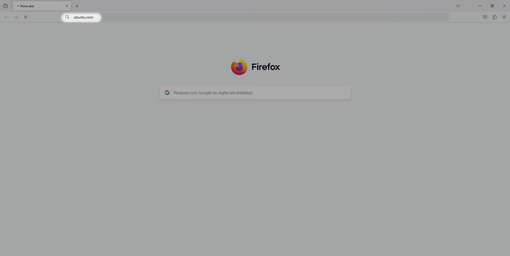

---

## 2. Aceite os cookies do site

Ao acessar o site, pode aparecer uma mensagem solicitando o seu consentimento para o uso de cookies. Clique em **"Accept all and visit site"**.

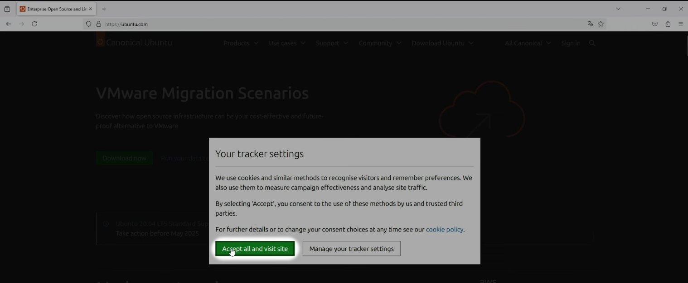

---

## 3. Baixe a versão Desktop do Ubuntu

No topo do site, vá até a aba **"Download"** e selecione a opção **"Ubuntu Desktop"**.

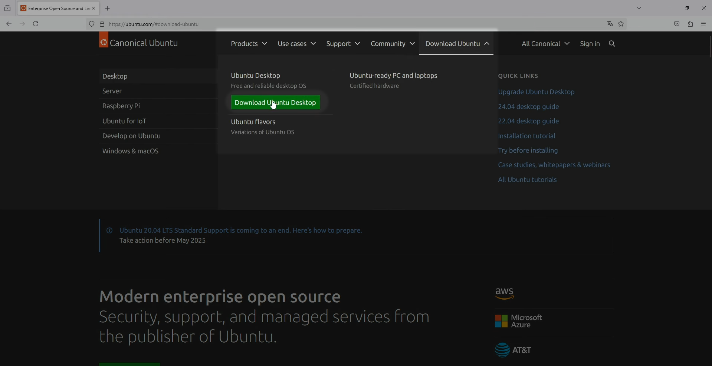

---

## 4. Escolha a versão LTS (Long Term Support)

Você verá algumas versões disponíveis. Vamos escolher a **LTS**, que é a mais estável e recomendada para a maioria dos usuários. Ela recebe atualizações por 5 anos.

Clique em **"Download 24.04.2 LTS"**.

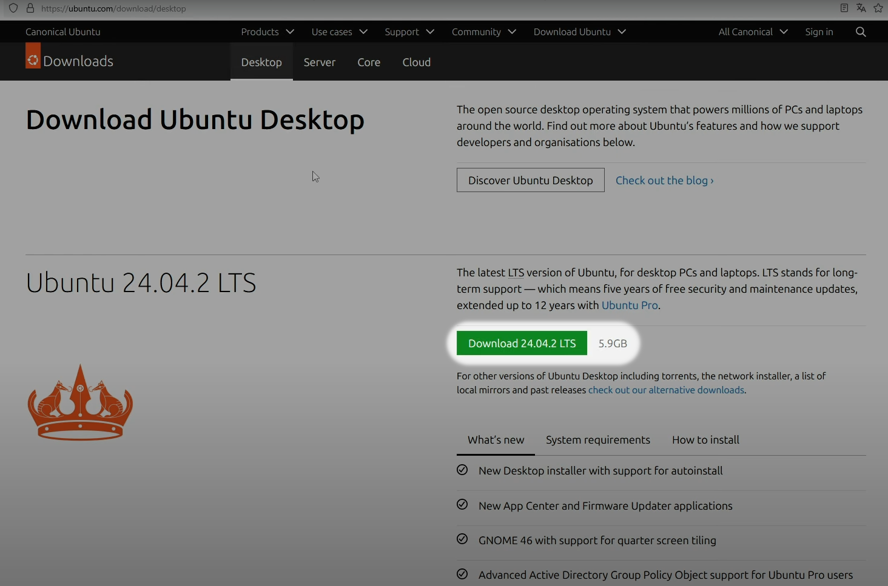

---

## 5. Agora vamos baixar o Balena Etcher

Abra uma nova aba no navegador e pesquise por **"balena etcher"** no Google. Clique no link que leva ao site oficial `etcher.balena.io`.

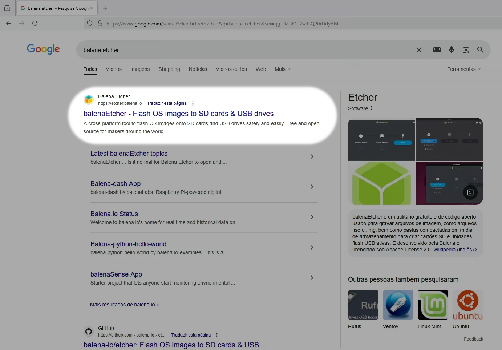

---

## 6. Vá até a página de download

No site do Balena Etcher, clique no botão **"Download"**.

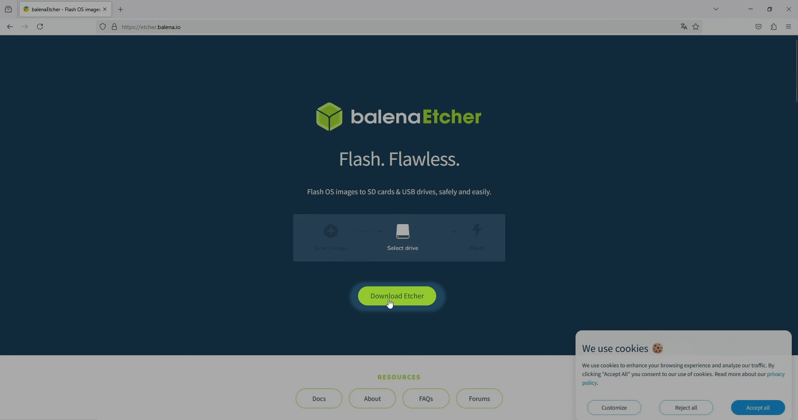

---

## 7. Escolha a versão para o seu sistema operacional

Selecione a opção correspondente ao seu sistema. Neste tutorial, estamos usando **Windows**, se também for o seu caso, então clique em **"Windows (x64) Installer"**.

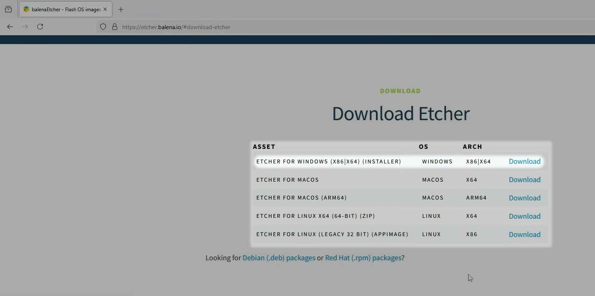

---

## 8. Encontre os arquivos baixados

Após o download, localize os arquivos na pasta **Downloads**: o instalador do Balena Etcher e o arquivo `.iso` do Ubuntu.

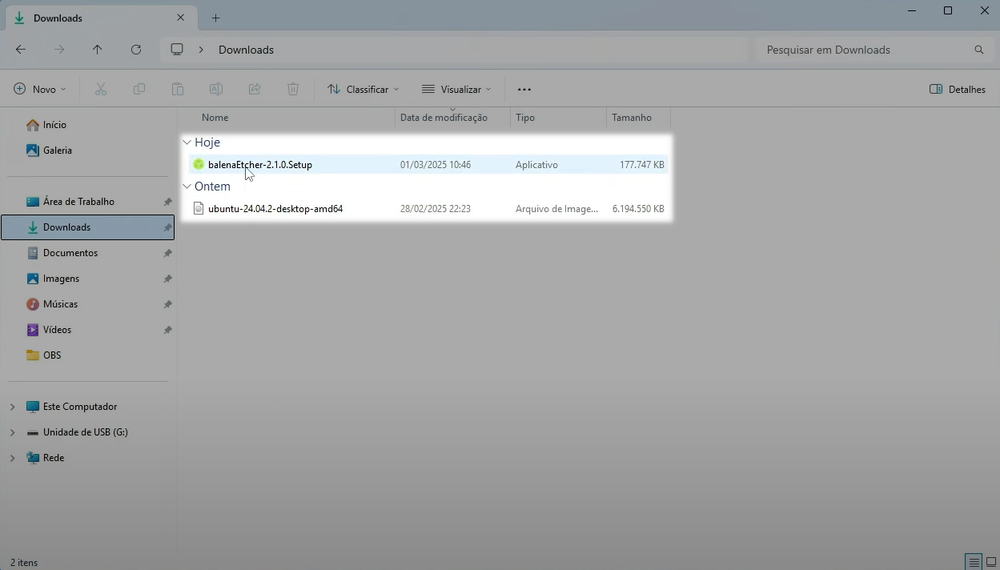

---

## 9. Instale o Balena Etcher

Dê dois cliques no instalador no Balena Etcher para começar a instalação. Ele será instalado automaticamente e, após, será executado.

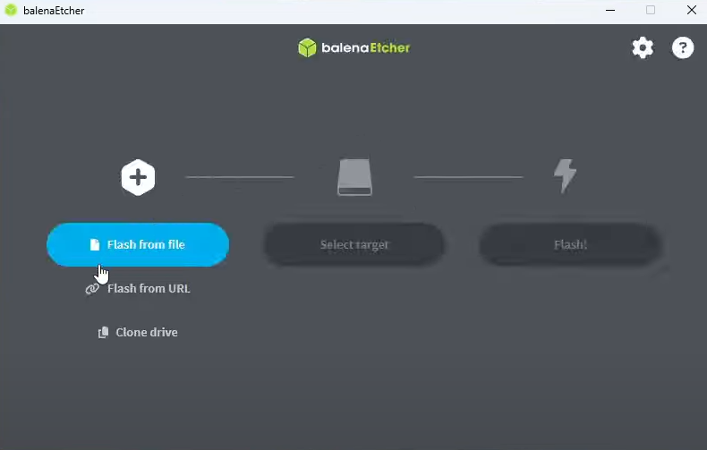

---

## 10. Inicie o Balena Etcher

Quando o programa abrir, clique em **"Flash from file"**.

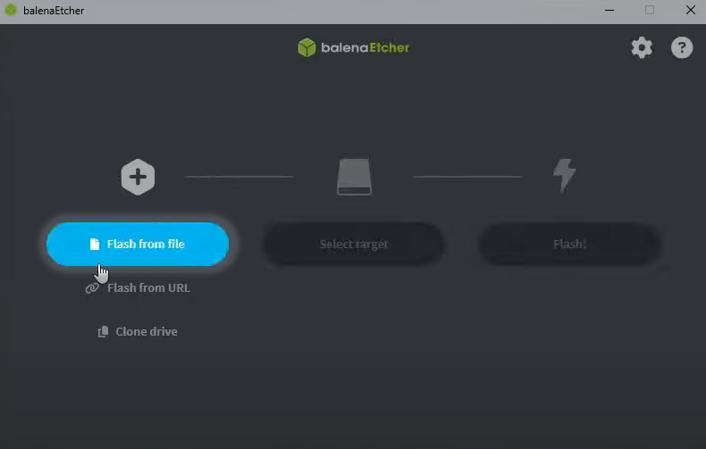

---

## 11. Escolha o arquivo ISO do Ubuntu

Navegue até onde você salvou o arquivo `.iso` do Ubuntu e selecione-o.

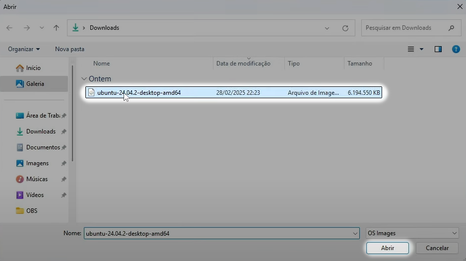

---

## 12. Selecione o pendrive

Agora clique em **"Select target"** para escolher o seu pendrive.

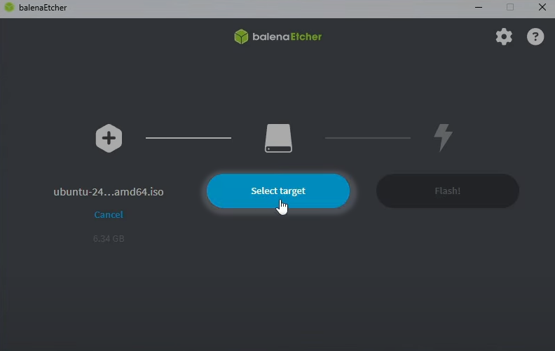

---

## ⚠️ Atenção! ⚠️

Antes de continuar, **tenha certeza de que fez backup dos arquivos importantes do seu pendrive**, pois ele será **formatado** neste processo.

Selecione o pendrive (ou HD externo) onde o Ubuntu será instalado. Ele precisa ter, no mínimo, **8GB de espaço**. Neste tutorial, utilizamos um de **7,74 GB** para um instalador de aproximadamente **5,9 GB**.

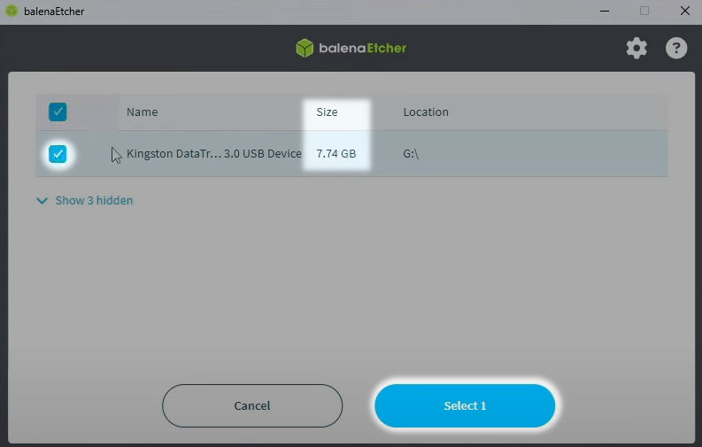

---

## 13. Comece a gravação da imagem

Agora, no Balena Etcher, clique no botão **"Flash!"** para iniciar o processo.

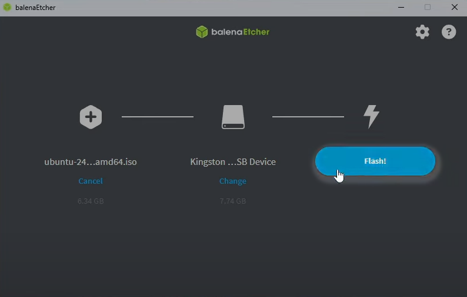

---

## 14. Autorize a gravação

Pode ser que o Windows exiba uma mensagem pedindo sua autorização para que o Balena Etcher faça alterações. Se isso acontecer, clique em **"Sim"**.

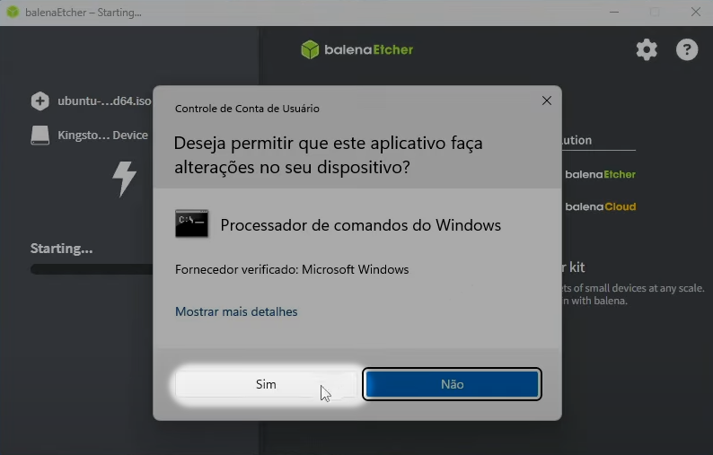

---

## ⚠️ Atenção! ⚠️

Durante esse processo, **não remova o pendrive** ou o HD Externo. Isso pode corromper os dados e impedir que o Ubuntu funcione corretamente.

---

## 15. Aguarde a gravação da imagem

Depois de clicar em "Sim", o Balena Etcher irá iniciar o processo de gravação da imagem do Ubuntu no seu pendrive.

Você verá uma barra de progresso acompanhando cada etapa.

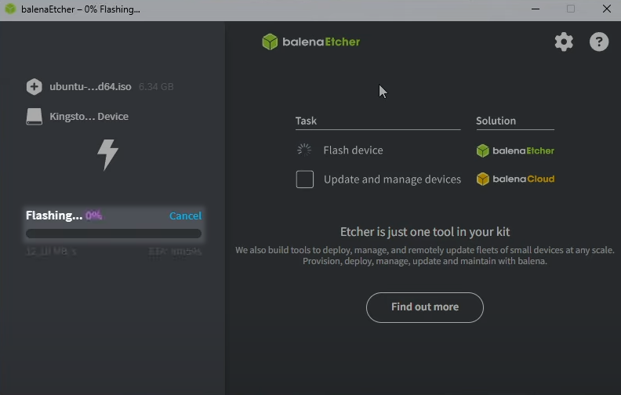

---

## 16. Verificação automática

Ao final da gravação, o Balena Etcher irá verificar se a gravação foi concluída com sucesso. Esse processo é automático e leva mais alguns minutos.

Você verá uma mensagem de confirmação quando tudo estiver pronto.

---

## 17. Finalize o processo

Assim que a mensagem **"Flash Complete!"** aparecer, você pode fechar o Balena Etcher com segurança.

Pronto! Agora, a partir deste ponto, o seu pendrive está pronto para ser usado como um disco de instalação do Ubuntu.

---

## 18. Reinicie o computador

Deixe o pendrive conectado e reinicie o computador.

---

## 19. Acesse a BIOS/UEFI

Logo que o computador começar a reiniciar, pressione a tecla de atalho para entrar na BIOS ou UEFI.  
Geralmente, essa tecla aparece na tela inicial com uma mensagem como:

> _Press DEL or F2 to enter Setup_

Algumas das teclas mais comuns são: `F2`, `DEL`, `F12`, `ESC` ou `F10`.

---

## 20. Configure a ordem de boot

Dentro da BIOS/UEFI, vá até a aba de **"Boot"** e altere a ordem de inicialização.  
Certifique-se de colocar o **pendrive** como primeira opção.

Salve as alterações (geralmente com a tecla `F10`) e saia.

---

## 21. Inicie a instalação do Ubuntu

Se tudo estiver certo, o computador irá iniciar a partir do pendrive e você verá a tela de boas-vindas do Ubuntu.

Aqui você pode escolher:

- Testar o Ubuntu sem instalar
- Iniciar a instalação imediatamente

Escolha a opção **"Try or Install Ubuntu"** com a tecla _ENTER_ para continuar.

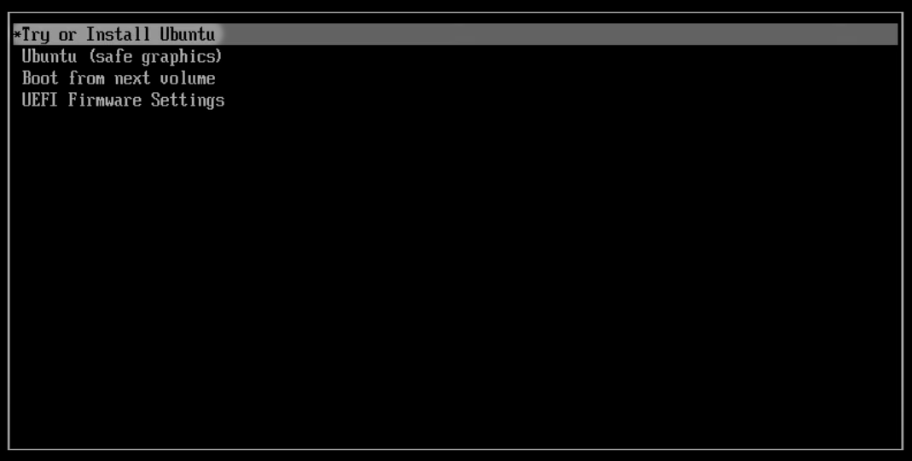

---

## ℹ️ Informação! ℹ️

Agora o Ubuntu irá carregar o instalador (Sistema Live do Ubuntu).

A partir daqui, o instalador irá guiá-lo com uma interface amigável e, após você selecionar o idioma na primeira etapa, em português.

---

## 22. Siga as instruções do instalador

Nas interfaces do instalador você poderá definir ao escolher:

- Idioma
  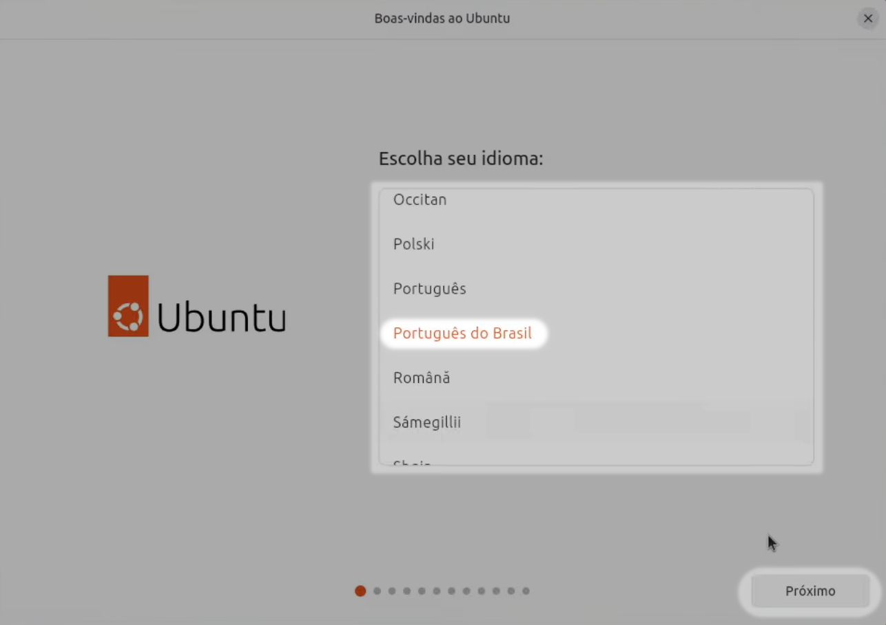
- Assecibilidade
- Layout do teclado (selecione também na Disposição do teclado)
- Conexão com a internet
- O que fazer: **Instalar Ubuntu**
- **Instalação interativa**
- **Instalação padrão**
- _Selecione_ as opções de Instalar software proprietário recomendado
  > - Instalar Drivers permitirá instalar os drivers de vídeos
  > - Baixar e instalar permitirá instalar kodecs necessários para os drivers
- Onde o Ubuntu será instalado?
  > - Instalar o Ubuntu ao lado do Windows (disponível para Windows 11)
  > - Apagar o disco e Instalar o Ubuntu (⚠️ Se você selecionar a opção de apagar o disco e instalar o Ubuntu, **todos os dados do HD serão apagados**. Certifique-se de ter backup do que for importante.)
  > - Particionamento manual (recomendado para separar o diretório home (/home) da raíz (/))
  >   > > - ⚠️ **Atenção**: reserve ao menos 8GB para o diretório da raíz (/), para a instalação do Ubuntu
  >   > > - ⚠️ _Para computadores com 8GB ou menos de **Memória RAM**_ reserve uma repartição do tipo **SWAP** de 4GB para o computador não "travar"
  >   > > - Os **tipos** de repartição para a **/** ou para **/home**, são **Ext4**
  >   >
  >   > - Configure a sua conta: com seu nome, nome do computador, usuário (administrador) e a senha para esse usuário.
  >   > - Defina o fuso horário: _selecionando_ a região que você mora.
  >   > - Revise suas escolhas e, finalmente: **Instalar** e aguarde.

---

## ℹ️ Informação! ℹ️

A instalação irá levar alguns minutos.

---

## 23. Conclua a instalação

Quando a instalação for finalizada, o sistema pedirá para reiniciar o computador. Você já pode remover o pendrive neste momento.

- Clique em **"Reiniciar agora"** e aguarde.

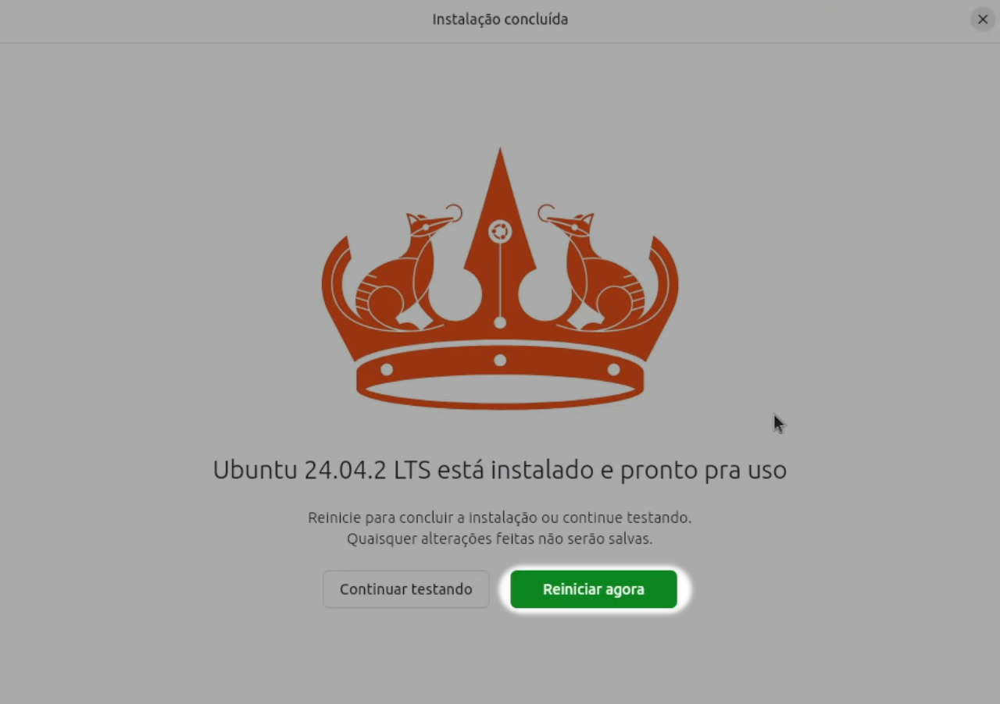

---

## ℹ️ Informação! ℹ️

Se tudo até aqui estiver correto, irá aparece a tela de login após a reinicialização do sistema.

- **Faça o login**

---

## 24. Boas vindas!

Interface de boas vindas

- Clique em **Próximo** > **Ignorar** > (Não partilhar os dados) **Próximo** > **Concluído**

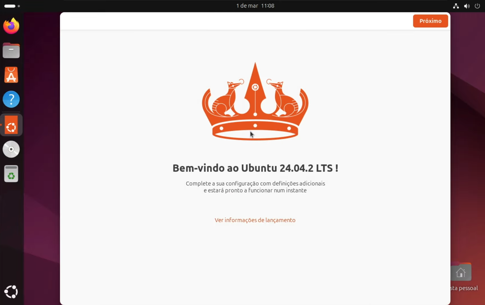

---

## 25. Pronto!

Agora, por último, vá em **Menu de Aplicativos** e clique em **Atualizador de programas**.

- Este software irá verificar se tem alguma atualização necessária. Caso tenha, clique em **Instalar agora**.

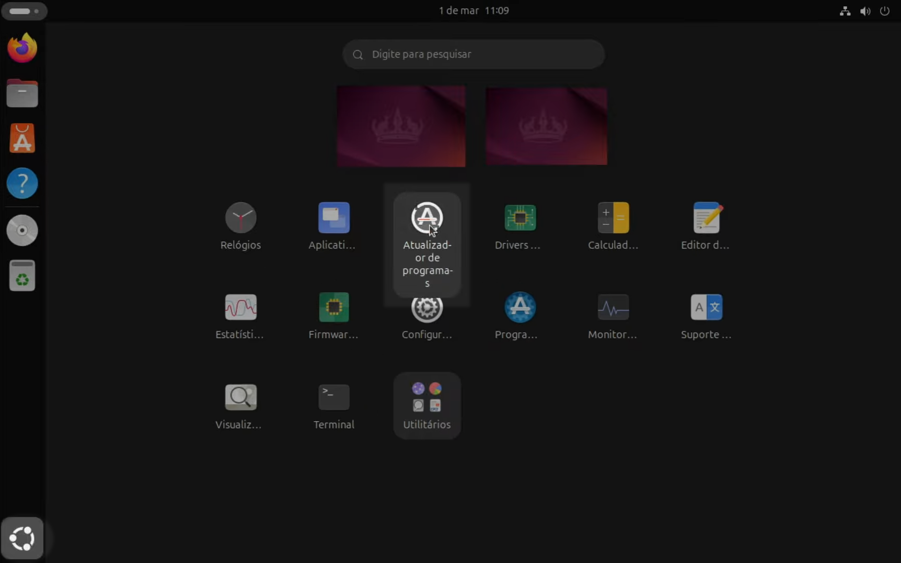

---

## 👏 Parabéns! 👏

Agora você está com o Ubuntu instalado e pronto para usar.

---

## 👍 Recomende! 👍

Se esse tutorial te ajudou, compartilhe com alguém que também queira dar os primeiros passos no Linux. 💻🐧
